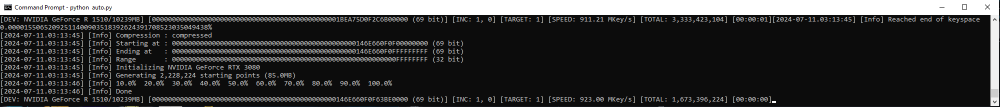

# Puzzle-Work
List of searched ranges
From puzzle 69 to 130

With python script to do it yourself
# Auto.py
auto.py uses your gpu and bitcrack to search a random 32 bit range inside the puzzle bit size you set

# AutoKangaroo.py
autokangaroo.py uses JeanLucPons Kangaroo and searches 2^52 ranges on the cpu 

you'll need listk.txt file for the already searched ranges

a cmd file with your kangaroo params inside 

and finally you will need a file.txt the program will use this to put the start and end range and the public key for kangaroo to run

